## simple_graph_plot.do

This file plots scatter diagram, line graph, histogram and bar diagram.
 
<!-- 
<b>Simple scatter plot diagram</b>
  -->

  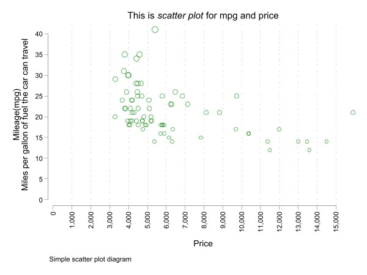
  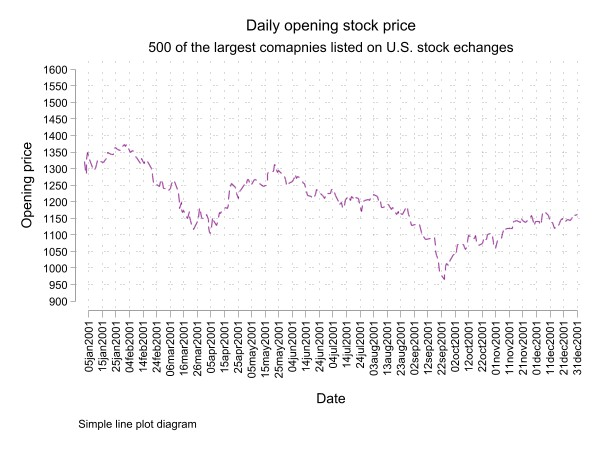
  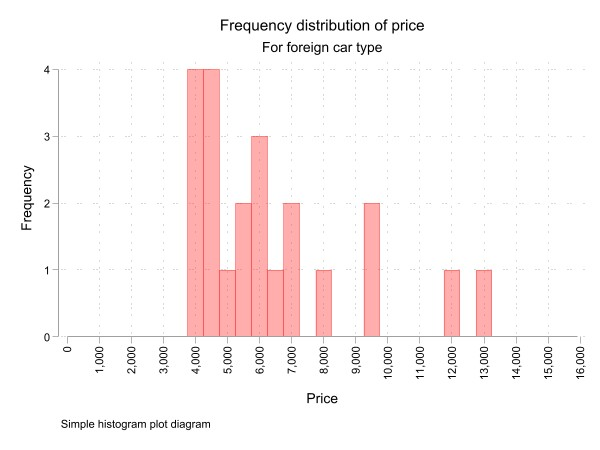
  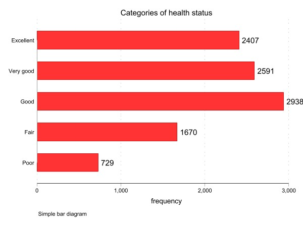

## graph_plot_with_by_group.do

This file plots scatter diagram, line graph, histogram and bar diagram in groups of data.
 
<!-- 
<b>Simple scatter plot diagram</b>
  -->

  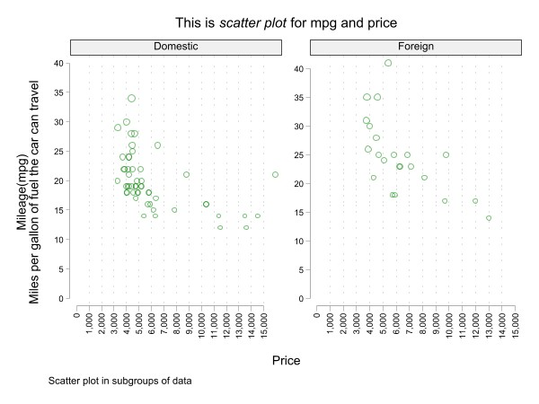
  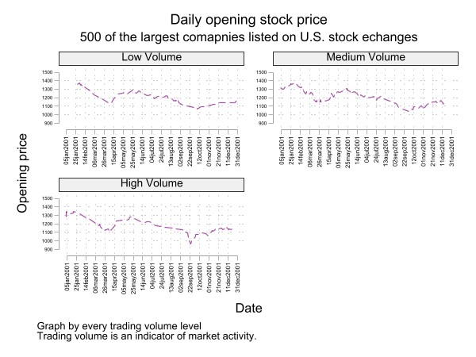
  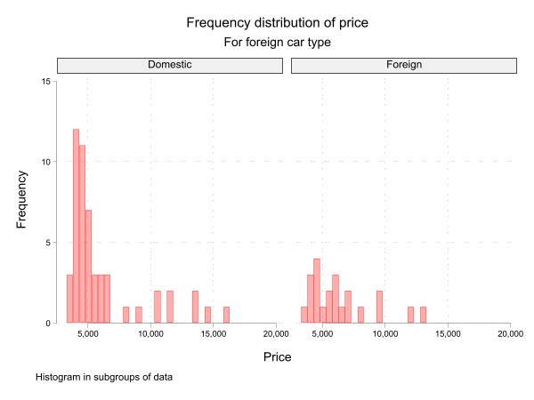
  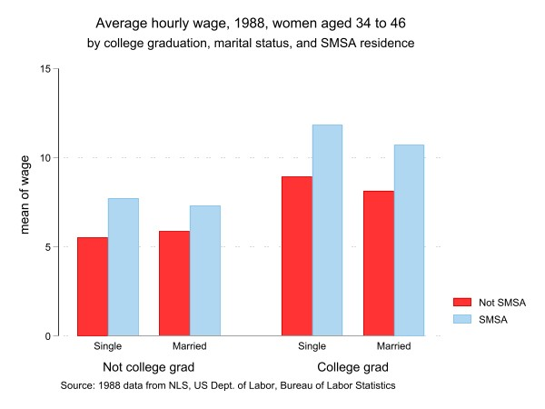

## two_way_plot.do

This file plots two way scatter diagram, two way line graph, two way histogram and two way bar diagram.
 
<!-- 
<b>Simple scatter plot diagram</b>
  -->

  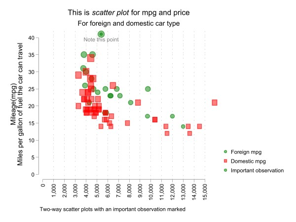
  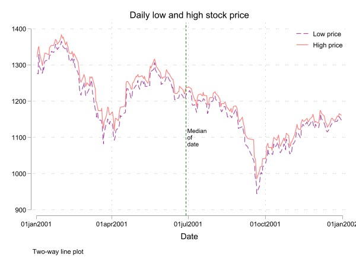
  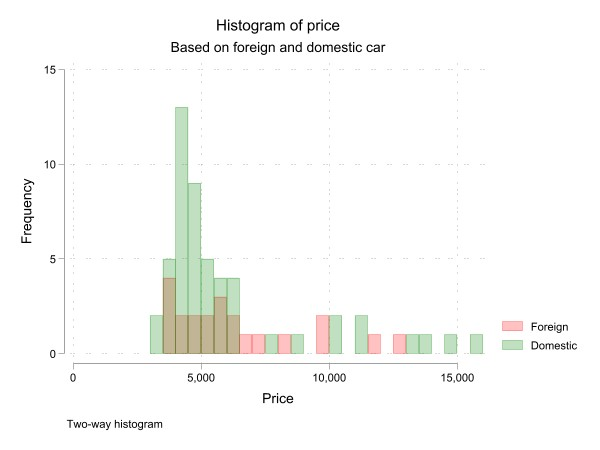
  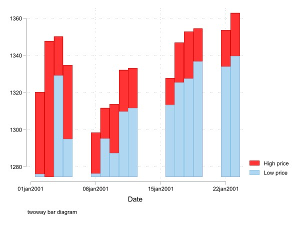

## two_way_plot_with_by_group.do

This file plots two way scatter diagram, two way line graph, two way histogram and two way bar diagram in groups of data.
 
<!-- 
<b>Simple scatter plot diagram</b>
  -->

  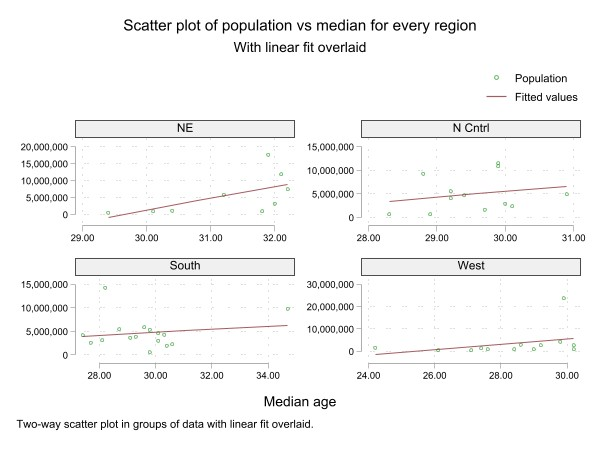
  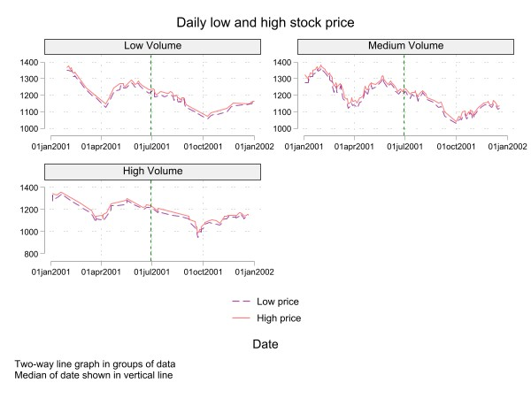
  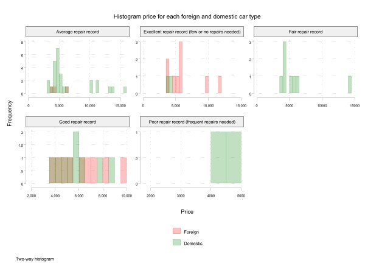
  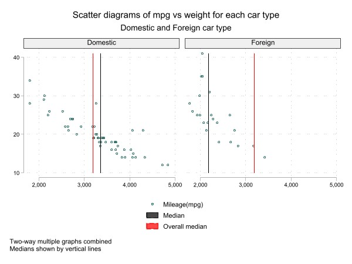

## linear_fit.do
This code plots a scatter plot diagram with a linear fit overlay

  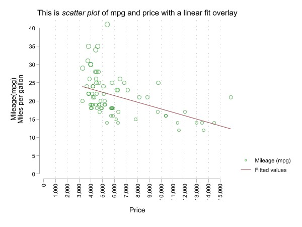

## graph_combine.do
The code combines distinct graph into a single graph window

  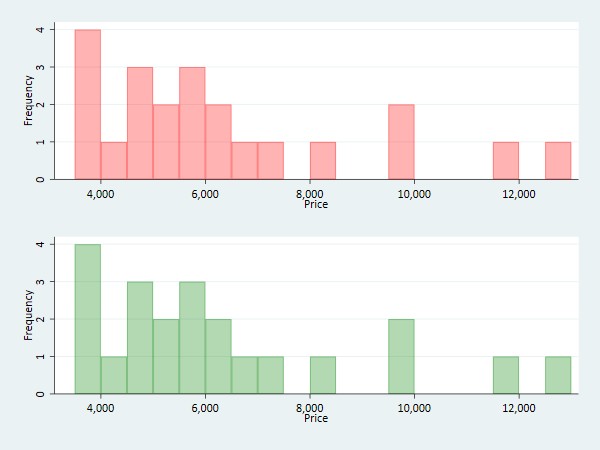
  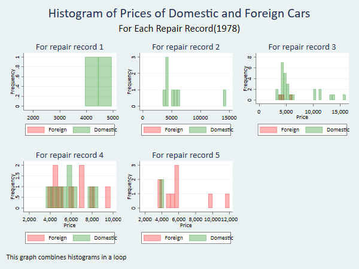

## confidence_interval.do
The code shows a linear fit prediction plot for mpg on weight with a 95% confidence interval of the prediction

  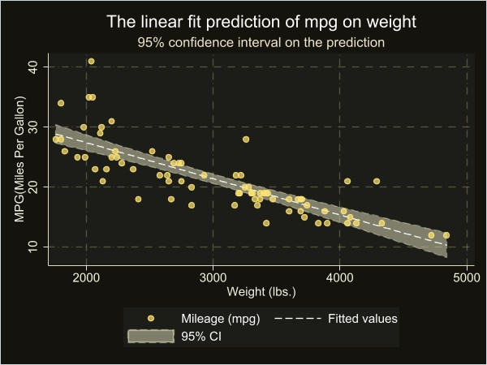

<!-- 
<b>Simple line plot diagram</b>
 

  

<b>Simple histogram plot diagram</b>
 

  

<b>Simple bar  diagram</b>
 

  

 -->

